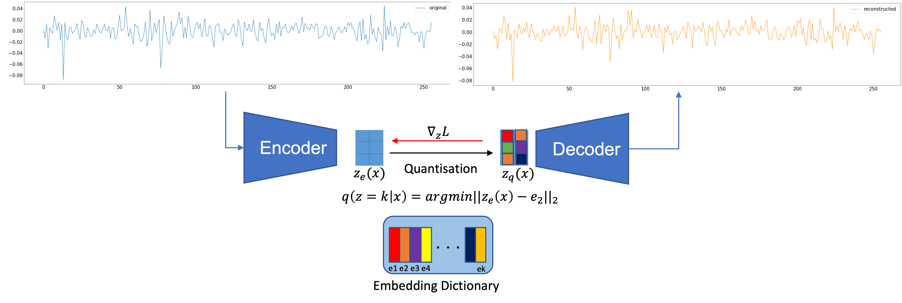

# Synthetic Financial Time-Series Generation with Vector Quantised -Variational Auto Encoders 
## M.Sc. Artificial Intelligence and Machine Learning
### Student Name:  Daniel Ricardo Zapata Sanabria

This repository contains various Jupyter Notebook files and directories related to the dissertation project. Below is a brief description of each file and directory:

## Files:
### 1) `data/download_data/download.ipynb`
- **Description:** This Jupyter Notebook file download the S&P 500 stock data from Yahoo Finance.  
**Output:** data/download_data/sp500_joined_closes.csv

### 2) `preprocess.ipynb`

- **Description:** This Jupyter Notebook file likely contains code related to data preprocessing steps. It calculates the stocks' returns and generates the batches to feed.
**Input:** data/download_data/sp500_joined_closes.csv
**Output:** master_data/data.npy

### 3) `VAE_pytorch.ipynb`

- **Description:** This Jupyter Notebook file contains code and plots related to the Variational Autoencoder models implemented using PyTorch. Explores VAE architecture, training, and generation.
**Input:** master_data/data.npy
**Outputs:** 
generated_data/vae[MODEL NAME].npy
models/vae[MODEL NAME].pth
plots/training/[MODEL NAME]_*.png

### 4) `VQ-VAE_pytorch.ipynb`

- **Description:** This Jupyter Notebook file contains code and plots related to the Vector Quantised Variational Autoencoder models implemented using PyTorch. Explores VQ-VAE architecture, training, and generation.
**Input:** master_data/data.npy
**Outputs:** 
generated_data/vqvae[MODEL NAME].npy
models/vqvae[MODEL NAME].pth
plots/training/[MODEL NAME]_*.png

### 5) `qualitative_evaluation.ipynb`

- **Description:** This Jupyter Notebook file is focused on qualitative evaluation metrics. It includes visual inspections between generated and real batches.
**Inputs:** 
master_data/data.npy
generated_data/[MODEL NAME].npy
**Outputs:** 
plots/qualitative/*
### 5.1) `fat_tailed.ipynb`

- **Description:** This Jupyter Notebook file contains code to calculate the alpha exponent of fat-tailed distributions for the generated data.

### 6) `quantitative_evaluation.ipynb`

- **Description:** This Jupyter Notebook file contains code related to quantitative evaluation metrics. It includes the code to compare the probability distributions between generated and real data.

**Inputs:** 
master_data/data.npy
generated_data/[MODEL NAME].npy
**Outputs:** 
plots/results/*

## Directories:
### `generated_data`

- **Description:** This directory contains model-generated data.

### `master_data`

- **Description:** This directory contains the preprocessed batches to train the models.

### `plots`

- **Description:** This directory contains the different plots shown in the report and more.

### `results`

- **Description:** This directory has the quantitative results metrics.

Please refer to the specific files and directories for more detailed information on each aspect of the project. If you have any questions or need further assistance, feel free to reach out to drz236@student.bham.ac.uk.

